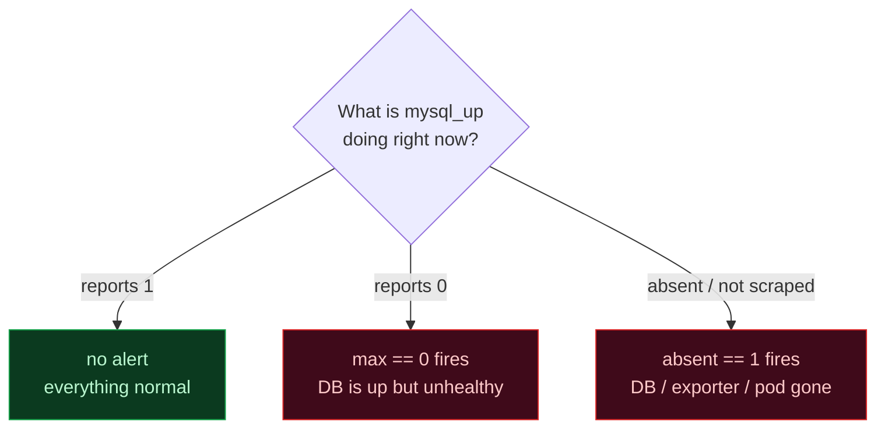
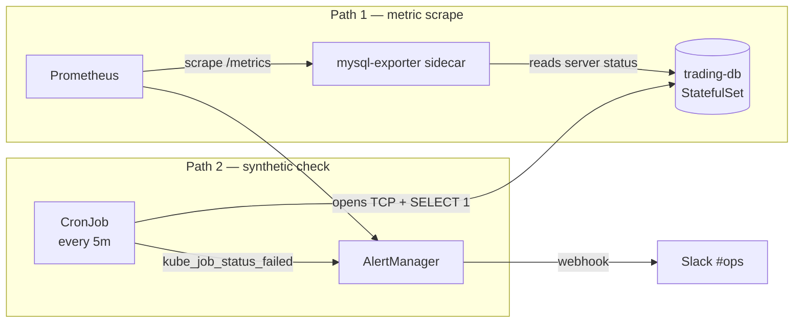

I built monitoring for a Kubernetes platform recently and ran straight into the most common Prometheus alerting mistake I've ever seen — twice in the same week. Both times I caught it because I tested the alert by *deleting the thing being monitored*, which is the only test that matters.

Here's the rule, the failure mode, and the fix.

## The naive rule

You have a MySQL pod and a `mysql-exporter` sidecar that emits `mysql_up` — a gauge that's `1` when the database is healthy and `0` when it's not. You write the obvious alert:

```yaml
- alert: TradingDBDown
  expr: mysql_up == 0
  for: 1m
  labels: { severity: critical }
  annotations:
    summary: MySQL trading-db is down
```

Read it out loud: *"Fire when `mysql_up` equals zero for one minute."* Sounds correct. Ship it.

It's wrong.

## The failure mode

Imagine the worst possible thing happens to your database. Not a crash — a full disappearance. The pod gets evicted, the StatefulSet scales to zero, someone deletes the namespace, a node failure leaves the workload unschedulable for ten minutes.

In all of those cases, **`mysql_up` doesn't return `0`**. It returns *nothing*. The metric stops existing.

Picture the scrape timeline: while the pod is healthy, every 15s Prometheus stores a `1`. The pod gets evicted at `t = 0`, and from then on the time series simply stops:

```mermaid
gantt
    title       mysql_up scrape timeline (15s interval)
    dateFormat  X
    axisFormat  %S

    section Healthy
    sample = 1   :done,    h1,  -75, 15s
    sample = 1   :done,    h2,  -60, 15s
    sample = 1   :done,    h3,  -45, 15s
    sample = 1   :done,    h4,  -30, 15s
    sample = 1   :done,    h5,  -15, 15s

    section Pod evicted
    no sample    :crit,    g1,  0,   15s
    no sample    :crit,    g2,  15,  15s
    no sample    :crit,    g3,  30,  15s
    no sample    :crit,    g4,  45,  15s
    no sample    :crit,    g5,  60,  15s
```



PromQL's behavior when a metric doesn't exist is to evaluate the expression on an empty result set. `(empty) == 0` is `false` — there's nothing to compare zero to. The alert is `Inactive`.

The exact moment your platform is most broken is the exact moment your alert is silent.

This is the bug that made me distrust every alert I've ever written. It's why production engineers eventually all start writing alerts that look paranoid.

## The fix: `absent()`

Prometheus has a built-in function whose entire purpose is "fire when this metric stops being scraped":

```
absent(mysql_up)
```

It returns `1` when the metric isn't present in any time series, and `0` (or no result) when it is. Combine it with the original check:

```yaml
- alert: TradingDBDown
  expr: max(mysql_up) == 0 or absent(mysql_up) == 1
  for: 1m
  labels: { severity: critical }
  annotations:
    summary: MySQL trading-db is unreachable
    description: |
      Either mysql_up reports zero, or the metric stopped existing entirely
      (pod gone, scrape failure, exporter crashed). Either way, traders
      can't query the database.
```

Read this one out loud: *"Fire when MySQL is reporting unhealthy, OR when MySQL has stopped reporting at all."* That's the alert you actually want.

The `max()` wrapper handles the case where you have multiple replicas — if any one of them is up, you don't fire. The `absent()` clause covers the catastrophic-disappearance case.

Each branch of the rule covers a distinct failure mode — together they form a complete coverage matrix:



## How I tested it

I scaled the StatefulSet to zero replicas and watched:

```bash
kubectl scale statefulset trading-db --replicas=0 -n trading
```

Within ~90 seconds, two alerts fired in Slack:

- `TradingDBDown` (the metric-based check, after the `for: 1m` clause expired)
- `TradingSyntheticCheckFailed` (a separate CronJob that opens an actual MySQL connection every five minutes and reports a job failure when it can't)

Two independent signals catching the same outage from different angles. The `absent()` rule caught the metric disappearing. The synthetic CronJob caught the actual connection refusal. **If Prometheus itself were down, the metric alert wouldn't fire — but the synthetic still would.** Defense in depth on monitoring.

The two probes ride different paths to the database, so one failing rarely silences the other:



## The pattern, generalized

Anywhere you have a `_up` style gauge and depend on its presence, write the alert as:

```
max(<metric_up>) == 0 or absent(<metric_up>) == 1
```

For continuous metrics like request rates, the equivalent is:

```
rate(http_requests_total[5m]) < threshold or absent(http_requests_total)
```

For job-based alerts (CronJob, Job), use `kube_job_status_failed > 0` plus an `absent_over_time(kube_job_status_completed[1h]) > 0` check to catch jobs that didn't run at all.

The unifying idea: **never trust that a metric will be there.**

## A heuristic for review

When I review alert rules now, I ask one question: *"Would this alert fire if the workload disappeared completely?"*

If the answer is *"no, because then the metric wouldn't exist either,"* the rule is wrong. Fix it before it bites you at 3 AM during the worst hour of your worst customer's quarter.

---

**Resources:**
- [Prometheus docs — `absent()` function](https://prometheus.io/docs/prometheus/latest/querying/functions/#absent)
- [Prometheus docs — `absent_over_time()`](https://prometheus.io/docs/prometheus/latest/querying/functions/#absent_over_time)
- [SRE Workbook — alerting on SLOs](https://sre.google/workbook/alerting-on-slos/)
