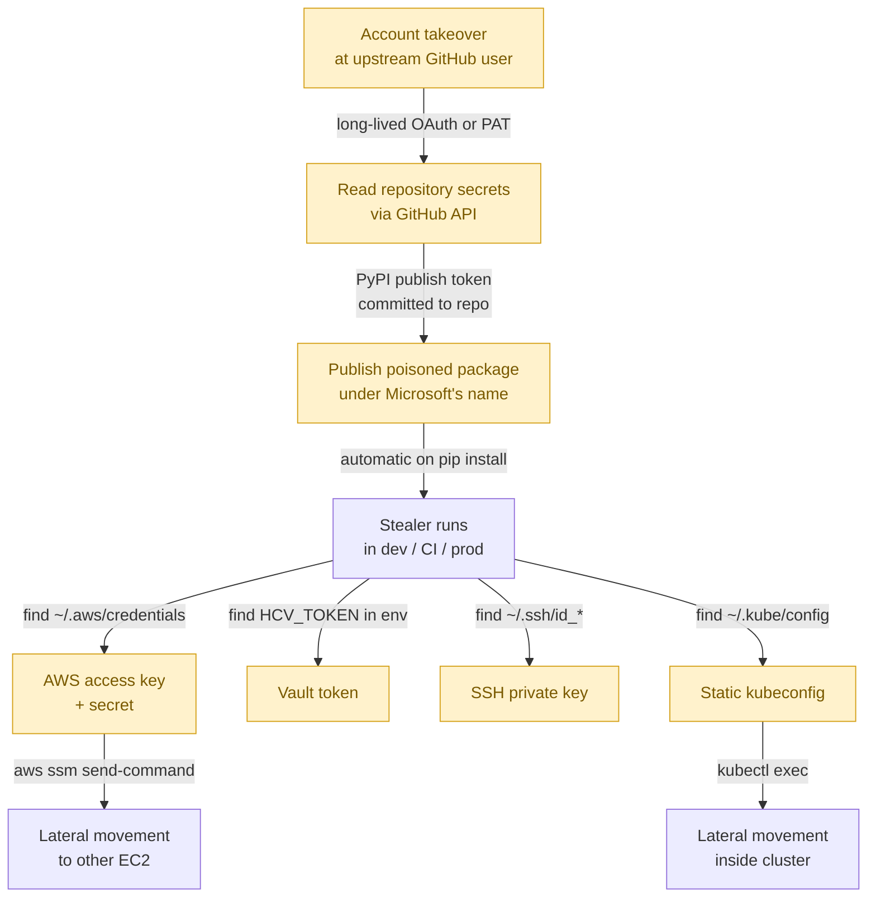

GitHub spent this week investigating an unauthorized-access claim while one of its own SDK packages was being weaponized to steal credentials from anything it could reach. Same threat actor — TeamPCP — both stories. The headlines are about malware. The actual lesson is about how we hand out long-lived secrets and what happens when one of them leaks.

If you have ten minutes today, here's what the durabletask compromise tells you about your own infrastructure.

## What happened, briefly

Microsoft publishes a Python client for the Durable Task workflow framework as the [`durabletask` PyPI package](https://pypi.org/project/durabletask/). On the order of 417,000 downloads per month. Three malicious versions — 1.4.1, 1.4.2, 1.4.3 — were published to PyPI after TeamPCP got into a GitHub account, dumped that account's secrets, found the PyPI publishing token in there, and shipped poisoned releases under Microsoft's name.

Once imported, the package runs a dropper that fetches a 28KB Python stealer from `check.git-service[.]com`. The stealer harvests:

- Cloud provider credentials (AWS, GCP, Azure)
- HashiCorp Vault KV secrets
- 1Password and Bitwarden vault contents
- SSH keys
- Docker credentials
- VPN configs
- Shell history

Then it propagates. Inside AWS, it enumerates SSM-managed EC2 instances and uses `aws ssm send-command` with the `AWS-RunShellScript` document to execute the same payload on up to five other instances per profile. Inside Kubernetes, it propagates through `kubectl exec`. If it detects Israeli or Iranian locale settings, there's a one-in-six chance it runs `rm -rf /*`.

In parallel, the same group is offering ~4,000 of GitHub's internal repositories for sale at $50K+. GitHub says no customer data is impacted "so far."

The campaign is being called [Mini Shai-Hulud](https://thehackernews.com/2026/05/mini-shai-hulud-worm-compromises.html) — a follow-on to a worm pattern Wiz, Aikido, StepSecurity, and others have been tracking through TanStack, Mistral AI, Guardrails AI, and now Microsoft's own SDK.

## The actual story isn't the malware

What gets the headlines: cross-cloud propagation, the Vault-and-1Password sweep, the destructive payload, the locale-based targeting. All real, all worth tracking.

What's worth your time: **none of this works without a chain of static, long-lived credentials that never expire and never get rotated.**

Walk through the chain again:



Every yellow node is a long-lived credential. Every arrow is a step that only works because the credential at the source had no meaningful expiry, no use-binding, and no detection signal when used from a new place.

- The upstream GitHub PAT or OAuth token had no rotation policy
- The PyPI publish token was checked into a repo as a "GitHub secret" — long-lived
- The AWS access key in `~/.aws/credentials` was static, with no MFA or session constraint
- The Vault token was a service token with broad read on KV
- The kubeconfig held an X.509 client cert with no expiry mechanism

Take any single one of those and make it short-lived plus identity-bound, and the chain breaks at that step. The malware itself is the easy part of this story to reproduce. The credential laundry the attacker rode through is the hard part to fix, and it's the part nobody has fully fixed.

## What gets through this story without trouble

Two patterns survive Mini Shai-Hulud at every step:

**Workload identity** with short-lived, automatically-rotated tokens. EKS Pod Identity, GCP Workload Identity, GitHub Actions OIDC → AWS, Azure Workload Identity. The pod gets a 1-hour token via metadata service. There is no file on disk for the stealer to read. The stealer is still root inside the container, but there's nothing to exfiltrate that retains value beyond the next hour.

**Per-session certs from an access platform** — Teleport, BeyondTrust, StrongDM, equivalent. The user's kubeconfig holds a cert good for hours, not days. Audit log captures who got it, when, and what they ran. If `~/.kube/config` gets stolen, the cert in it dies fast — and the next request from a new source IP at minimum gets flagged.

What doesn't survive: anything stored in a dotfile that grants `>=1 day` of access to anything valuable. Every workflow that depends on "I committed my AWS access key as a CI secret three years ago and it still works." Every kubeconfig that's been on a laptop for a year because nobody told the user it needed to be regenerated.

## What I'd actually do this week if I ran a team

Three things, ranked by how much they reduce blast radius per hour of work:

**1. Hunt long-lived AWS access keys.**

```bash
aws iam list-users --query 'Users[*].UserName' --output text | \
  xargs -I {} aws iam list-access-keys --user-name {} \
    --query 'AccessKeyMetadata[?Status==`Active`].[UserName, AccessKeyId, CreateDate]' \
    --output text
```

Anything older than 90 days that isn't a break-glass key needs a deletion plan. Anything attached to a human user (not a service role) gets migrated to SSO + temporary credentials.

**2. Rotate every CI secret that has the word `TOKEN`, `KEY`, or `PASSWORD` in its name.**

It costs you a few hours of debugging broken pipelines. It saves you from being the next durabletask-scale story. The point isn't that any specific secret is compromised today — the point is that your default time-to-rotate should be measured in months, not "never."

**3. Audit every place a kubeconfig lives outside `~/.kube/config`.**

Backup tools. Sync clients. Slack DMs where you sent a config to a teammate two years ago. The cert in those files probably still works, because by default nothing in vanilla Kubernetes is going to tell you it shouldn't.

This is the same gap I spent a week chasing in my [take-home for a Teleport interview](https://github.com/fabiorollin/teleport-takehome). Vanilla Kubernetes does CSR-based onboarding with X.509 client certs and gives you no way to revoke them short of rebuilding the cluster CA. cert-manager solves this for workload TLS — server certs get auto-rotated. There's no equivalent built-in mechanism for user certs.

That's the missing lifecycle layer Mini Shai-Hulud is exploiting at scale. The fix isn't more malware detection. The fix is making the credentials worth less when stolen.

## The uncomfortable framing

If your incident-response runbook for "compromised dev laptop" still says "rotate the affected credentials and notify the user," you have already lost the race the next time a Mini Shai-Hulud variant runs in your supply chain. By the time you know which credentials were stolen, the attacker has used them to mint persistence in your cloud and your cluster.

The runbook needs to change to: *"assume every credential that touched this laptop in the last N days is compromised, and verify that each one was either short-lived or has already been rotated."* That's only operationally possible if N is small. Which means the long-lived credentials need to die before the next incident, not after.

We've known this since the [Codecov breach in 2021](https://about.codecov.io/security-update/). The TeampPCP campaign is just the highest-velocity reminder so far.

---

**Sources:**
- *[GitHub Investigating TeamPCP Claimed Breach of ~4,000 Internal Repositories](https://thehackernews.com/2026/05/github-investigating-teampcp-claimed.html)* — The Hacker News, May 20, 2026
- *[durabletask supply chain attack](https://www.wiz.io/blog/durabletask-teampcp-supply-chain-attack)* — Wiz
- *[Malicious durabletask PyPI supply chain attack](https://safedep.io/malicious-durabletask-pypi-supply-chain-attack/)* — SafeDep
- *[durabletask package compromised — Mini Shai-Hulud](https://www.aikido.dev/blog/durabletask-package-compromised-mini-shai-hulud)* — Aikido Security
- *[Microsoft's durabletask PyPI package compromised in supply chain attack](https://www.stepsecurity.io/blog/microsofts-durabletask-pypi-package-compromised-in-supply-chain-attack)* — StepSecurity
- *[Trojanized Microsoft SDK durabletask 1.4.1 through 1.4.3](https://www.endorlabs.com/learn/trojanized-microsoft-sdk-durabletask-1-4-1-through-1-4-3-deliver-credential-stealing-malware)* — Endor Labs
