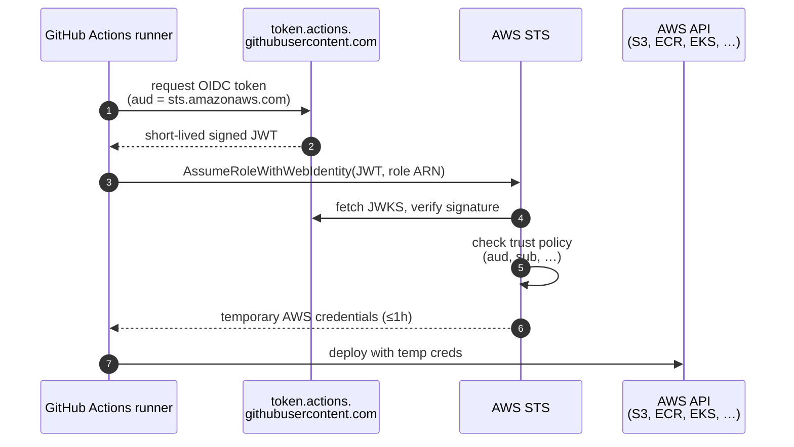
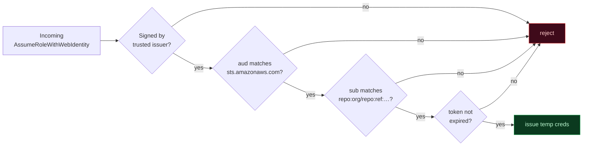
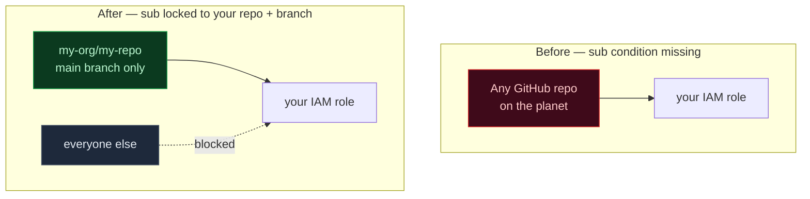

You've probably done this before:

> *"How do I deploy to AWS from GitHub Actions without storing access keys as GitHub secrets?"*

You search, you find a guide, you paste a JSON blob into IAM, you click through, the deploy works, you move on. The blob is forgotten until something breaks.

That blob is one of the most architecturally important configurations in your entire AWS account. It deserves five minutes of attention.

## What's actually happening when the workflow runs

Before we read the JSON, look at the handshake the JSON is gating:



Every box in that diagram is shaped by the trust policy on the role. The JSON below is the rule sheet that AWS STS consults at step 5.

## The artifact

Here's the trust policy you (or some guide) put on an IAM role — let's call it `github-actions-deployer`:

```json
{
  "Version": "2012-10-17",
  "Statement": [
    {
      "Effect": "Allow",
      "Principal": {
        "Federated": "arn:aws:iam::123456789012:oidc-provider/token.actions.githubusercontent.com"
      },
      "Action": "sts:AssumeRoleWithWebIdentity",
      "Condition": {
        "StringEquals": {
          "token.actions.githubusercontent.com:aud": "sts.amazonaws.com"
        },
        "StringLike": {
          "token.actions.githubusercontent.com:sub": "repo:my-org/my-repo:ref:refs/heads/main"
        }
      }
    }
  ]
}
```

Six fields. Each one matters. Walk through them with me.

## Field 1: The principal is a federated identity provider, not an IAM user

```json
"Principal": {
  "Federated": "arn:aws:iam::123456789012:oidc-provider/token.actions.githubusercontent.com"
}
```

This is the keystone of the whole pattern.

`Federated:` means *"trust an external identity provider, not an AWS-internal credential."* AWS isn't trusting an access key. It isn't trusting a secret. It's trusting **tokens signed by GitHub Actions' OIDC issuer.**

When a GitHub Actions workflow runs, GitHub mints a short-lived JWT and signs it with their private key. AWS receives that JWT during the assume-role call, fetches GitHub's *public* keys via JWKS, validates the signature, and — if the rest of the conditions match — grants temporary credentials.

**No keys live on either side that you have to rotate.** GitHub rotates its signing keys; AWS picks up the new ones via JWKS automatically. The trust expires the moment the workflow finishes.

If GitHub Actions disappeared tomorrow, the trust evaporates. Nothing to clean up beyond deleting the role.

## Field 2: `sts:AssumeRoleWithWebIdentity` is the OIDC-aware STS call

```json
"Action": "sts:AssumeRoleWithWebIdentity"
```

There are several ways to assume an IAM role. `AssumeRole`, `AssumeRoleWithSAML`, `AssumeRoleWithWebIdentity`. They're not interchangeable — each accepts different proof-of-identity.

`AssumeRoleWithWebIdentity` is the *only* one that accepts an OIDC token. It's the same call:

- Kubernetes ServiceAccounts use to assume IAM roles via IRSA (IAM Roles for Service Accounts)
- GKE workloads use for Workload Identity Federation
- GitLab CI uses for its OIDC-to-AWS integration
- Any custom service that signs OIDC tokens uses to authenticate to AWS

Recognizing this call is recognizing the entire cloud-to-cloud federation pattern. Once you've seen it once, you see it everywhere.

## Field 3: The audience claim restricts who can replay the token

```json
"Condition": {
  "StringEquals": {
    "token.actions.githubusercontent.com:aud": "sts.amazonaws.com"
  }
}
```

GitHub Actions can mint OIDC tokens for many purposes, not just AWS. It can mint tokens for HashiCorp Vault, for Google Cloud, for your own services. Each consumer wants to be sure the token was *intended* for them.

The `aud` (audience) claim solves this. When GitHub Actions mints a token to assume an AWS role, the `aud` is set to `sts.amazonaws.com` — *"this token is for AWS STS, not Vault, not GCP, not anything else."*

If an attacker stole a GitHub-signed OIDC token meant for Vault and tried to replay it against AWS, this condition would reject it. **The audience claim is the primary defense against cross-service token replay.**

This is the field most pasted-from-a-guide trust policies don't think about. They include it because the guide said to. Now you know why.

Visualize the four checks STS runs as a filter pipeline — the request only reaches your AWS API if it survives every stage:



## Field 4: The subject claim restricts which workflow can assume the role

```json
"StringLike": {
  "token.actions.githubusercontent.com:sub": "repo:my-org/my-repo:ref:refs/heads/main"
}
```

Without this condition, *any* GitHub Actions workflow in the world could assume your role — they'd all sign tokens with GitHub's key, all set the audience to `sts.amazonaws.com`. Your role would be a backdoor for the entire planet.

The `sub` (subject) claim narrows the trust to a specific repository, ref, or environment. The format is `repo:OWNER/REPO:ref:refs/heads/BRANCH` for branch-scoped trust. You can also scope by:

- **Tag**: `repo:my-org/my-repo:ref:refs/tags/v1.2.3`
- **Pull request**: `repo:my-org/my-repo:pull_request`
- **Environment**: `repo:my-org/my-repo:environment:production`

The narrower this claim, the smaller your blast radius. *"Only the production deploy from main can assume this role"* is much safer than *"any workflow on this repo can assume this role."*

If the wildcard `StringLike` makes you nervous, switch to `StringEquals` and lock to a specific subject. The pattern matching is convenient for matching across many tags but expensive in safety surface.

## How to read your own trust policy in five minutes

Open AWS Console → IAM → Roles → pick any role with a `Federated` principal → Trust relationships. Walk these four questions:

1. **Whose tokens does it trust?** *(the OIDC provider in the principal)*
2. **What kind of assume-role call does it accept?** *(the action — should always be `AssumeRoleWithWebIdentity` for OIDC)*
3. **What audience does the token need?** *(the `aud` condition — protects against cross-service replay)*
4. **What subject does the token need?** *(the `sub` condition — protects against cross-tenant replay)*

If any of those answers makes you uncomfortable, you've found a hardening opportunity. The most common gap I see in real deployments: a role that trusts a federated principal but has no `sub` condition. That role is assumable by any workflow in any GitHub org on the planet that targets that AWS account.

The shape of "before vs. after" tightening that gap:



## What I'd add for production

Three extras worth considering on top of what most guides give you:

**1. `aws:SourceIdentity` condition.** Require the workflow to set a source identity that ties back to a human or a system. Then every CloudTrail entry shows *who* triggered the assume-role, not just *what role* assumed it. Useful for audit.

**2. Permissions boundary on the role itself.** Even if someone exploits a misconfigured trust policy, a permissions boundary limits the *maximum* damage. A boundary that says *"this role can never have IAM:CreateUser permission"* survives a careless inline-policy edit.

**3. Session duration tightened.** The default is one hour. For deploy roles that finish in five minutes, set `MaxSessionDuration` to 900 seconds. Smaller window for stolen credentials to be useful.

## The takeaway

Federation policies are six fields of JSON. They're also the configuration that decides whether your AWS account is genuinely safe or just appears to be.

Next time you're pasting a trust policy from a guide — and we all do — pause for the five-minute walk-through. Either you'll feel better about what you just deployed, or you'll find a gap to close. Both are wins.

---

**Resources:**
- [AWS docs — Configuring OpenID Connect in AWS](https://docs.aws.amazon.com/IAM/latest/UserGuide/id_roles_providers_create_oidc.html)
- [GitHub docs — About security hardening with OpenID Connect](https://docs.github.com/en/actions/security-guides/security-hardening-your-deployments/about-security-hardening-with-openid-connect)
- [AWS docs — `aws:SourceIdentity` condition key](https://docs.aws.amazon.com/IAM/latest/UserGuide/reference_policies_condition-keys.html#condition-keys-sourceidentity)
