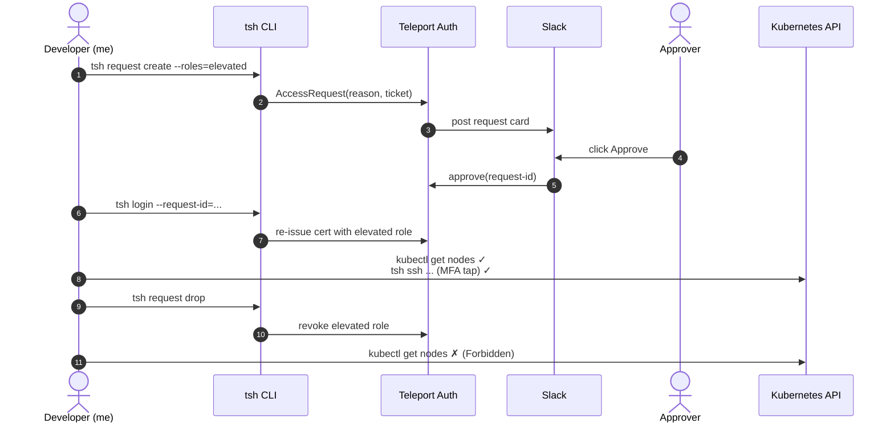
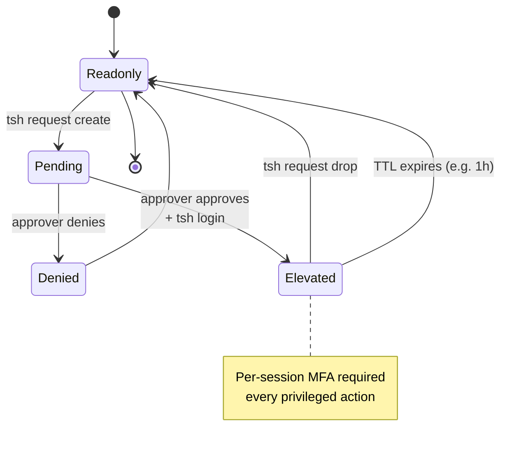

Just-in-time access is the headline feature of every modern access platform. Teleport, StrongDM, BeyondTrust — they all do it. By the time a candidate is doing a live demo, the interviewer has watched fifty *"watch me file a request and get approved"* sequences this quarter alone.

If you want yours to land, **show the full lifecycle, not just the elevation.**

Here's the 90-second beat that worked.



## The setup

Two terminals open. Same machine, two different identities:

- **Window A** is *me as a developer* — logged in via GitHub OIDC with one role: `trading-support-readonly`. Can read pods in the `trading` namespace, can't read cluster-scoped resources, can't `kubectl exec`.
- **Window B** is *me as an admin* — same Teleport tenant, but mapped to admin roles. This window approves access requests.

Slack open in a third surface, with the Teleport access-request plugin posting to `#teleport-access-requests`.

## The five-act narration

**Act 1 (15s) — show the access gap.**

```bash
$ tsh status
Roles: access, trading-support-readonly

$ kubectl get pods -n trading
NAME                                READY   STATUS    RESTARTS
trading-contacts-6d75c66cf-8ctx4    1/1     Running   0
trading-db-0                        2/2     Running   0
...

$ kubectl get nodes
Error from server (Forbidden): nodes is forbidden:
User "fabiorollin" cannot list resource "nodes" in API group ""
at the cluster scope
```

Land the line: *"Notice the error names me explicitly. My Teleport identity is captured even though Kubernetes is enforcing its own RBAC. Defense in depth: Teleport authenticates, Kubernetes authorizes."*

**Act 2 (15s) — file the request.**

```bash
$ tsh request create \
    --roles=trading-support-elevated \
    --reason="investigating cluster node health · ticket TS-1842"
```

Switch to Slack. The notification arrives in `#teleport-access-requests` within two seconds — requester, role, reason, ticket ID.

Land: *"The chat client they already have open becomes the access-control surface. No new tool to learn."*

**Act 3 (10s) — approve.**

In Slack: click **Approve.** Done.

**Act 4 (20s) — use the elevated role.**

Back in Window A:

```bash
$ tsh login --request-id=<id-from-create>

$ tsh status
Roles: access, trading-support-elevated, trading-support-readonly

$ kubectl get nodes
NAME                                            STATUS   ROLES   AGE
i-0abc123...                                    Ready    <none>  3d

$ tsh ssh ubuntu@ip-172-31-85-144
[MFA prompt — tap hardware key]
ubuntu@ip-172-31-85-144:~$ whoami
ubuntu
ubuntu@ip-172-31-85-144:~$ exit
```

Land: *"Per-session MFA. Even with a stolen Teleport cert, that hardware key is required."*

**Act 5 (15s) — drop the elevation.** *This is the part most demos skip.*

```bash
$ tsh request drop

$ kubectl get nodes
Error from server (Forbidden): nodes is forbidden:
User "fabiorollin" cannot list resource "nodes" in API group ""
at the cluster scope
```

Land: *"Forbidden again. The elevation expired the moment I dropped it. Audit log still records the four minutes I had it. Standing privilege is the bug. Just-in-time **AND** just-for-the-duration is the fix."*

That's the punchline.

## Why the drop matters

Most candidates think the demo's strongest moment is the approval — the satisfying click, the MFA tap, the *"and now I'm in"* beat. That's actually the *expected* moment. Of course it works. That's what the product does.

The unexpected moment is when you voluntarily *give up* the elevated role and prove the door closes behind you. **It demonstrates that you understand JIT means time-bound, not just permission-bound.**

It's also the closest analog to how production engineers actually use these systems. You don't keep elevated forever. You ask for it, you do the thing, you drop it. The audit log shows a four-minute window of privilege bracketed by *requested* and *dropped*. That's a forensics-friendly artifact.

A standing-admin culture creates pages of activity that all blur together. A JIT-with-drop culture creates discrete sessions you can investigate one at a time.

Plotted on a timeline, the demo flow looks like this — note how narrow the elevated band is:

```mermaid
gantt
    title       90-second JIT lifecycle
    dateFormat  X
    axisFormat  %S

    section Identity
    readonly (default)        :active,   r1,  0,   25s
    elevated (granted)        :crit,     e1,  25,  45s
    readonly (after drop)     :active,   r2,  70,  20s

    section Beats
    show access gap           :milestone, m1, 15, 0s
    request created           :milestone, m2, 25, 0s
    approved in Slack         :milestone, m3, 35, 0s
    SSH + MFA tap             :milestone, m4, 60, 0s
    tsh request drop          :milestone, m5, 70, 0s
    forbidden (proven)        :milestone, m6, 80, 0s
```



## The audit log as a closing beat

After the drop, navigate to Teleport's Audit → Session Recordings page and click the most recent session. Show what was captured:

- Original GitHub identity: `fabiorollin@gmail.com`
- Role chain: `trading-support-readonly → trading-support-elevated`
- Per-session MFA: ✓ verified
- Reason: the text from `--reason`
- Duration

Land: *"Every privileged action — what it was, who authorized it, who did it, why, for how long. Forensics-ready by default."*

That's the demo's strongest 15 seconds.



## What I'd cut

Three things I see candidates do that don't help:

1. **Reading every field on the access request page.** Approver clicks Approve. Move on.
2. **Explaining what MFA is.** Your audience knows. The fact that it fired is enough.
3. **Showing every protocol Teleport supports.** The one you're demoing is enough; mention the others.

The cut version takes a longer demo from twelve minutes to eight. **Demos lose people on minutes, not seconds.**

---

**Resources:**
- [Teleport docs — Access Requests](https://goteleport.com/docs/access-controls/access-requests/)
- [Teleport docs — Per-session MFA](https://goteleport.com/docs/access-controls/guides/per-session-mfa/)
